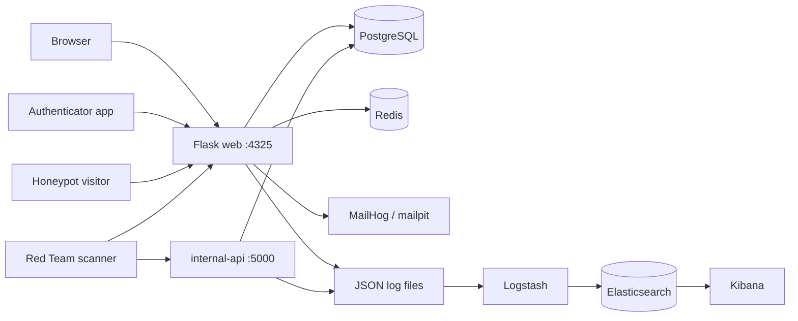

# DriftLock — Blue Team MFA Portal

DriftLock is a TOTP-based multi-factor authentication portal built as the Blue Team deliverable for a Red-vs-Blue Capture-the-Flag exercise. It is a realistic web application, secured with genuine controls, that contains three deliberate, documented vulnerabilities at increasing difficulty for the Red Team to discover — and is wrapped in logging, a honeypot, and an ELK monitoring stack so the Blue Team can detect and analyze the attack.

## What it does

Users register an account by providing a username, email address, and password. The system securely hashes the password using **bcrypt**. During registration, the user scans a QR code to complete the initial account setup.

When logging in, the user first enters their username (or email) and password. If the credentials are valid, the system generates a one-time password (OTP) and sends it to the user's registered email address.

For development and testing, **MailHog** is available at **http://localhost:8025/** and acts as a dummy mail server. The user retrieves the OTP from MailHog and enters it to complete the login process. Authentication is successful only after both the password (something the user knows) and the emailed OTP (something the user receives) are verified.


TOTP here protects DriftLock's own login — one issuer, one secret per user (a 1:1 relationship). It is a login second factor, not a multi-service authenticator vault.

## How it works (the security design)

DriftLock is a deliberately-defended target. Three layers make that work:

1. **Realistic security controls.** Password hashing (bcrypt), encrypted TOTP secrets (Fernet), input validation on registration, rate limiting (Flask-Limiter, backed by Redis), session-based authentication, and a two-step login (password then TOTP) with protections against username enumeration and session fixation.

2. **Three intentional vulnerabilities.** The app contains three deliberate, documented weaknesses at increasing difficulty: an unauthenticated /api/debug endpoint (information disclosure), TOTP code replay (no single-use enforcement), and an IDOR in a separate internal API (broken access control). Each is documented below so graders understand they were deliberate; everything else is meant to be secure.

3. **Self-monitoring / detection.** Every request is logged. A honeypot advertises a fake /backup_secrets/ folder via robots.txt and fires a CRITICAL alert the instant anyone touches it. All logs flow through Logstash into Elasticsearch and are visualized in Kibana, giving the Blue Team a live view for triage and incident response.

## The detection loop

A single attack traces through every component:

Red Team packet -> app logs the request -> if it touches the honeypot or trips a detection, an alert fires -> Logstash ships the log into Elasticsearch -> Kibana surfaces it -> an analyst correlates the attacker's actions into one confirmed incident and separates it from benign noise -> that becomes the incident-response report.

## Architecture

DriftLock runs as a set of Docker Compose services on one isolated lab network. Two Flask services — the web portal (`:4325`) and a separate, scannable `internal-api` (`:5000`) — share a single PostgreSQL database. The web service leans on Redis for rate limiting and lockout, and captures login OTP email through MailHog. Every request is written to JSON/plain log files, which Logstash mounts read-only and parses into Elasticsearch, where an analyst runs triage in Kibana.



### Components

| Component | Port (host to container) | Role |
|-----------|----------------------|------|
| web (Flask) | 4325 | Main portal: registration, login, MFA, support, honeypot, `/api/debug` |
| internal-api (Flask) | 5000 | Separate scannable service; hosts the IDOR vulnerability |
| db (PostgreSQL 16) | 5433 to 5432 | Shared database for both app services |
| redis | 6379 | Rate-limit counters + login-lockout tracking |
| mailpit (MailHog) | 1025 (SMTP), 8025 (UI) | Captures login OTP and reset emails in dev |
| elasticsearch | 9200 | Log storage and search |
| logstash | — | Parses log files, ships structured events to Elasticsearch |
| kibana | 5601 | Analyst dashboards for triage and incident response |

Both app services share the same PostgreSQL database. All four log files are written under `logs/` and mounted read-only into Logstash, which fans them out to four Elasticsearch indices (see the ELK indices section).

## Tech stack

- Backend: `Python / Flask`
- Database: `PostgreSQL`
- Cache / rate-limit store: `Redis`
- TOTP: `pyotp`
- Crypto: `bcrypt (passwords)`, `Fernet (TOTP seeds)`
- Monitoring: `Elasticsearch`, `Logstash`, `Kibana (ELK)`
- Deployment: `Docker Compose`
- App port: `4325 (web portal, non-standard per the brief)`
- Internal API port: `5000 (internal-api — separate service, discoverable by scan)`

## Running the project

### Local Python (development)

```
python3 -m venv venv
source venv/bin/activate
pip install -r web/requirements.txt
```

Never commit the venv/ directory.

### Full stack (Docker)

Bring up the application services:

```
docker compose up -d db redis web internal-api
```

Bring up the monitoring stack:

```
docker compose up -d elasticsearch
# wait for it to become healthy, then:
docker compose up -d kibana logstash
```

Key endpoints once running:

- App: `http://localhost:4325/`

- Internal API: `http://localhost:5000/`

- Kibana: `http://localhost:5601/`

- Elasticsearch: `http://localhost:9200/`

- Mailhog `http://localhost:8025/`
  
On Linux, Elasticsearch may require: sudo sysctl -w vm.max_map_count=262144

### Required environment variables (.env, gitignored)

- DB_USER, DB_PASSWORD, DB_NAME — `database credentials`
- MASTER_KEY — `Fernet key encrypting TOTP seeds at rest`
- SECRET_KEY — `Flask session signing key`

## Repository Structure

### Current (as built)

```
blue-team-mfa-portal/
├── docker-compose.yml            # web + db + redis + internal-api + ELK
├── .env                          # secrets (gitignored)
├── .gitignore
├── README.md
│
├── web/
│   ├── app.py                    # Flask app, routes, logging, rate limiting;
│   │                             #   /api/debug = intentional vuln (EASY)
│   ├── auth.py                   # registration, login, verify-mfa, logout
│   ├── crypto_utils.py           # password hashing + TOTP seed encryption
│   ├── mfa.py                    # TOTP blueprint (totp_bp): dashboard, current-code
│   ├── decorators.py             # @login_required
│   ├── models.py                 # DB models (User, TOTPSeed, etc.)
│   ├── honeypot.py               # honeypot blueprint: robots.txt bait +
│   │                             #   /backup_secrets/ trap, embedded decoy
│   ├── robots.txt                # discloses /backup_secrets/ — bait
│   ├── requirements.txt
│   ├── Dockerfile
│   ├── templates/                # index, login, register, mfa, mfa_verify, support, admin
│   └── static/                   # css, images
│
├── internal-api/                 # separate service, own port (5000) — scannable
│   ├── api.py                    #   IDOR vuln (HARD): /api/v1/users/<id>/setup-status
│   ├── requirements.txt
│   └── Dockerfile
│
├── db/
│   └── init.sql                  # users, totp_seeds, password_reset_tokens,
│                                 #   activity_logs, honeypot_logs
│
├── elk/
│   └── logstash/
│       └── pipeline/
│           └── logstash.conf     # grok-parses access.log; JSON-parses
│                                 #   honeypot.log + internal-api.log;
│                                 #   tags /backup_secrets/ as honeypot_hit
│
├── logs/
│   ├── access.log
│   ├── honeypot.log
│   ├── internal-api.log
│   └── captures/                 # Wireshark .pcap files
│
├── ctf-challenges/               # standalone CTF challenges for the other team
│   └── log-forensics/            #   (kept OUTSIDE logs/ — see CTF section)
│
└── reports/
    ├── 01-design-report.md
    ├── 02-hardening-report.md
    └── 03-incident-response.md
```

## Intentional vulnerabilities (disclosure)

DriftLock contains three deliberate, documented vulnerabilities at increasing difficulty. All are intentional and disclosed here for grading.

### Vulnerability 1 — EASY — Information disclosure

Endpoint: GET /api/debug (web, port 4325)
Type: Unauthenticated information disclosure
Exposes: Python version, platform, environment mode, and a hint pointing at the .env file
Discovery: reachable via port scan + path enumeration; no auth required
Detection: access is logged at WARNING and shipped to ELK
Fix (production): remove the endpoint or gate it behind authentication

### Vulnerability 2 — MEDIUM — TOTP replay

Location: MFA verification flow (web, port 4325)
Type: Missing one-time-use enforcement on TOTP codes
Exposes: a captured code remains valid for its ~90-second window and can be replayed, weakening the second factor
Discovery: capture a valid code and reuse it within the window
Detection: verification events are logged; reuse of the same time-window counter for a user flags mfa_replay_suspected
Fix (production): record consumed codes/counters and reject reuse

### Vulnerability 3 — HARD — IDOR / broken access control

Service: internal-api (port 5000 — a separate, scannable service)
Endpoint: GET /api/v1/users/<id>/setup-status
Type: Insecure Direct Object Reference — returns any user's account metadata when the <id> is changed, with no authorization check
Exposes: another user's username, mfa_enabled status, and account creation time
Discovery: found via port scan as a second service, then path probing reveals the enumerable ID
Detection: the service logs ID access; one source reading 3+ distinct IDs escalates to a CRITICAL idor_enumeration_suspected alert in ELK
Fix (production): authenticate the caller and enforce requested_id == caller_id, or use unguessable identifiers; do not expose internal APIs to untrusted networks

Disclosure note: These three vulnerabilities are intentional CTF targets. Every other part of the application is meant to be secure — any weakness beyond these three is an accidental defect, not a planted target.

## ELK indices

driftlock-access-* — all HTTP access logs (web)
driftlock-honeypot-* — high-priority honeypot alerts
driftlock-internal-api-* — internal-api requests + IDOR enumeration alerts

## CTF Challenges (for the other team)

Separate from DriftLock's own intentional vulnerabilities, we author a set of **standalone CTF challenges** for another Blue/Red group working on a different application. These challenges are self-contained and are **not** derived from DriftLock's three planted vulnerabilities — they exercise general skills (log triage, forensics, decoding) that complement this project's recon-and-detect theme.

### Log-forensics challenge set

Three log-analysis challenges at increasing difficulty. Players search realistic, noisy server logs to recover a hidden flag — reinforcing the same Blue Team log-triage skills used in incident response. The *technique* scales across tiers, not just the obscurity.

| Tier   | File                | Skill tested            | Flag                       |
|--------|---------------------|-------------------------|----------------------------|
| Easy   | detect_easy.log     | Basic log search (grep) | `CTF{L0G_GR3P_EASY}`       |
| Medium | detect_medium.log   | Signal-in-noise triage  | `CTF{N015Y_L0G_M3D1UM}`    |
| Hard   | detect_hard.log     | Correlation + decoding  | `CTF{L0G_F0R3N51C5_H4RD}`  |

- **Easy** — the flag sits in plain text on an analyst-note line among normal access entries; solvable with a single targeted `grep`.
- **Medium** — the flag is buried in ~500 noisy lines, with decoy brace tokens (`session={...}`) that defeat a lazy `grep '{'`; players must match the exact `CTF{...}` pattern.
- **Hard** — the flag is base64-encoded and split into two labelled fragments far apart in a ~700-line file, with decoy base64 blobs as misdirection; players correlate the fragments, reassemble in order, then decode.

Flag format across all tiers: `CTF{...}`

### Challenge directory layout

```
ctf-challenges/
└── log-forensics/
    ├── README.md              # set overview + distribution instructions
    ├── easy/     detect_easy.log     + README.md   (prompt + 1 reserved hint)
    ├── medium/   detect_medium.log   + README.md   (prompt + 2 reserved hints)
    ├── hard/     detect_hard.log     + README.md   (prompt + 3 reserved hints)
    └── _graders/ answer_key.md        # flags + solve commands — KEEP PRIVATE
```

### Distribution rules

- Hand each team **only** the tier folder(s) being released (the `.log` file + its player `README.md`).
- **Never distribute `_graders/`** — it contains every flag and full solution.
- Keep `ctf-challenges/` **outside** the app's live `logs/` directory. DriftLock's `app.py`, `honeypot.py`, `internal-api/api.py`, and `detections.py` actively write to `logs/`, and Logstash mounts `./logs:ro` and ingests everything it finds — dropping challenge logs there would pollute the Elasticsearch indices and the project's own incident-response evidence.
- Player prompts point at the technique without naming the exact command; escalating hints live in collapsible blocks and are released only when a team is stuck (or as point-cost unlocks on a scoreboard such as CTFd).
- All challenge material stays on the isolated lab network.

## Reports

- reports/01-design-report.md — architecture, security controls, vulnerability rationale, Wireshark findings
- reports/02-hardening-report.md — security implementations, defense-in-depth
- reports/03-incident-response.md — attack evidence, detection method, log analysis, recommended fixes

## Project status

Complete: the defensive infrastructure (honeypot, request logging, the ELK monitoring pipeline with three indices, the internal-api service, and the Docker deployment); the two-step login flow (password -> TOTP) with enumeration and session-fixation protections; and session-based authorization on sensitive endpoints. The three intentional vulnerabilities are in place and documented.

Remaining:

- Set debug=False in app.py for graded/demo runs.
- Harden the MASTER_KEY fallback to fail closed.
- Build the false-positive traffic generator for realistic triage.
- Complete the three reports and the annotated Wireshark capture.

## Notes

All testing and scanning must occur only within the isolated lab environment.
The venv/ directory and .env file must never be committed.
