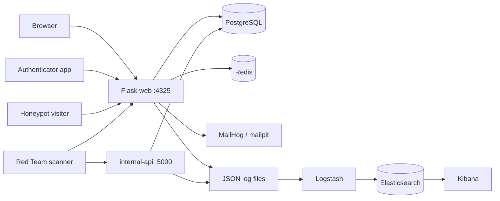

# DriftLock — Blue Team MFA Portal

DriftLock is a TOTP-based multi-factor authentication portal built as the Blue Team deliverable for a Red-vs-Blue Capture-the-Flag exercise. It is a realistic web application, secured with genuine controls, that contains three deliberate, documented vulnerabilities at increasing difficulty for the Red Team to discover — and is wrapped in logging, a honeypot, and an ELK monitoring stack so the Blue Team can detect and analyze the attack.

> **Branch note:** this is the `main` branch — the intentionally-vulnerable CTF target. The remediated version, with all findings fixed and verified, is on the `patched` branch.

---
## What it does

Users register an account by providing a username, email address, and password. The system securely hashes the password using **bcrypt**. During registration, the user scans a QR code to complete the initial account setup.

When logging in, the user first enters their username (or email) and password. If the credentials are valid, the system generates a one-time password (OTP) and sends it to the user's registered email address.

For development and testing, **MailHog** is available at **http://localhost:8025/** and acts as a dummy mail server. The user retrieves the OTP from MailHog and enters it to complete the login process. Authentication is successful only after both the password (something the user knows) and the emailed OTP (something the user receives) are verified.

TOTP here protects DriftLock's own login — one issuer, one secret per user (a 1:1 relationship). It is a login second factor, not a multi-service authenticator vault.

---

## How it works (the security design)

DriftLock is a deliberately-defended target. Three layers make that work:

1. **Realistic security controls.** Password hashing (bcrypt), encrypted TOTP secrets (Fernet), input validation on registration, rate limiting (Flask-Limiter, backed by Redis), session-based authentication, and a two-step login (password then OTP) with protections against username enumeration and session fixation.

2. **Three intentional vulnerabilities.** The app contains three deliberate, documented weaknesses at increasing difficulty: an unauthenticated /api/debug endpoint (information disclosure), TOTP code replay (no single-use enforcement), and an IDOR in a separate internal API (broken access control). Each is documented below so graders understand they were deliberate; everything else is meant to be secure.

3. **Self-monitoring / detection.** Every request is logged. A honeypot advertises a fake /backup_secrets/ folder via robots.txt and fires a CRITICAL alert the instant anyone touches it. All logs flow through Logstash into Elasticsearch and are visualized in Kibana, giving the Blue Team a live view for triage and incident response.

---

## The detection loop

A single attack traces through every component:

Red Team packet -> app logs the request -> if it touches the honeypot or trips a detection, an alert fires -> Logstash ships the log into Elasticsearch -> Kibana surfaces it -> an analyst correlates the attacker's actions into one confirmed incident and separates it from benign noise -> that becomes the incident-response report.

---

## Architecture

DriftLock runs as a set of Docker Compose services on one isolated lab network. Two Flask services — the web portal (`:4325`) and a separate, scannable `internal-api` (`:5000`) — share a single PostgreSQL database. The web service leans on Redis for rate limiting and lockout, and captures login OTP email through MailHog. Every request is written to JSON/plain log files, which Logstash mounts read-only and parses into Elasticsearch, where an analyst runs triage in Kibana.

### Network exposure (host firewall)

The host firewall (ufw) allows only **22 (SSH), 4325 (web portal), and 5000 (internal-api)** from the network. Kibana (5601) and MailHog (8025) are bound but **not exposed externally** — they are Blue Team tooling, reachable only on the host or via an SSH tunnel, so the attacking team cannot view the detection dashboards or captured mail. This is a deliberate defense-in-depth choice.


---
### Components

| Component | Port (host to container) | Role |
|-----------|----------------------|------|
| web (Flask) | 4325 | Main portal: registration, login, MFA, support, honeypot, `/api/debug` |
| internal-api (Flask) | 5000 | Separate scannable service; hosts the IDOR vulnerability |
| db (PostgreSQL 16) | 5433 to 5432 (localhost only) | Shared database for both app services |
| redis | 6379 (localhost only) | Rate-limit counters + login-lockout tracking |
| mailpit (MailHog) | 1025 (SMTP), 8025 (UI, host-only) | Captures login OTP and reset emails in dev |
| elasticsearch | 9200 | Log storage and search |
| logstash | — | Parses log files, ships structured events to Elasticsearch |
| kibana | 5601 (host-only) | Analyst dashboards for triage and incident response |

Both app services share the same PostgreSQL database. All four log files are written under `logs/` and mounted read-only into Logstash, which fans them out to Elasticsearch indices (see the ELK indices section).

---
## Tech stack

- Backend: `Python / Flask`
- Database: `PostgreSQL`
- Cache / rate-limit store: `Redis`
- TOTP: `pyotp`
- Crypto: `bcrypt (passwords)`, `Fernet (TOTP seeds)`
- Monitoring: `Elasticsearch`, `Logstash`, `Kibana (ELK)`
- Deployment: `Docker Compose`
- App port: `4325 (web portal, non-standard per the brief)`
- Internal API port: `5000 (internal-api — separate service, discoverable by scan)`
---
## Running the project

### Local Python (development)

```
python3 -m venv venv
source venv/bin/activate
pip install -r web/requirements.txt
```

Never commit the venv/ directory.

### Full stack (Docker)

Bring up the application services:

```
docker compose up -d db redis web internal-api
```

Bring up the monitoring stack:

```
docker compose up -d elasticsearch
# wait for it to become healthy, then:
docker compose up -d kibana logstash
```

Key endpoints once running:

- App: `http://localhost:4325/`
- Internal API: `http://localhost:5000/`
- Kibana: `http://localhost:5601/` (host-only)
- Elasticsearch: `http://localhost:9200/` (host-only)
- MailHog `http://localhost:8025/` (host-only)

On Linux, Elasticsearch may require: sudo sysctl -w vm.max_map_count=262144

### Required environment variables (.env, gitignored)

- DB_USER, DB_PASSWORD, DB_NAME — `database credentials`
- MASTER_KEY — `Fernet key encrypting TOTP seeds at rest`
- SECRET_KEY — `Flask session signing key`
---
## Repository Structure

```
blue-team-mfa-portal/
├── docker-compose.yml            # web + db + redis + internal-api + ELK
├── .env                          # secrets (gitignored)
├── .gitignore
├── README.md
│
├── web/
│   ├── app.py                    # Flask app, routes, logging, rate limiting;
│   │                             #   /api/debug = intentional vuln (MEDIUM)
│   ├── auth.py                   # registration, login, verify-mfa, logout
│   ├── reset.py                  # password-reset flow; Host Header Injection
│   │                             #   vuln (HARD) on main; fixed on patched
│   ├── crypto_utils.py           # password hashing + TOTP seed encryption
│   ├── mfa.py                    # TOTP blueprint (totp_bp): authenticator,
│   │                             #   current-code, add-device QR flow
│   ├── utils.py                  # QR code generation helpers (pyqrcode/qrcode);
│   │                             #   used by mfa.py for add-another-device feature
│   ├── decorators.py             # @login_required
│   ├── models.py                 # DB models (User, TOTPSeed,
│   │                             #   PasswordResetToken, etc.)
│   ├── honeypot.py               # honeypot blueprint: robots.txt bait +
│   │                             #   /backup_secrets/ trap, embedded decoy
│   ├── detections.py             # TOTP replay + IDOR enumeration detection
│   │                             #   helpers; writes to detections.log
│   ├── robots.txt                # discloses /backup_secrets/ — bait
│   ├── requirements.txt
│   ├── Dockerfile
│   ├── templates/                # index, login, register, mfa, mfa_verify,
│   │                             #   reset_request, reset_form, support, admin
│   └── static/                   # css, images
│
├── internal-api/                 # separate service, own port (5000) — scannable
│   ├── api.py                    #   IDOR vuln (EASY): GET /api/v1/users/<id>/setup-status
│   │                             #   no auth check; idor_enumeration_suspected
│   │                             #   alert at 3+ distinct IDs from one source
│   ├── requirements.txt
│   └── Dockerfile
│
├── db/
│   └── init.sql                  # users, totp_seeds, password_reset_tokens,
│                                 #   activity_logs, honeypot_logs
│
├── elk/
│   └── logstash/
│       └── pipeline/
│           └── logstash.conf     # grok-parses access.log; JSON-parses
│                                 #   honeypot.log + internal-api.log +
│                                 #   detections.log; ships to ES indices
│
├── logs/
│   ├── access.log                # all HTTP requests; WARNING events include
│   │                             #   debug hits, HOST_HEADER_ANOMALY,
│   │                             #   login/MFA failures, honeypot alerts
│   ├── honeypot.log              # structured JSON; honeypot_hit CRITICAL events
│   ├── internal-api.log          # structured JSON; setup_status_access +
│   │                             #   idor_enumeration_suspected events
│   ├── detections.log            # structured JSON; HOST_HEADER_ANOMALY +
│   │                             #   mfa_replay_suspected events
│   └── captures/                 # Wireshark evidence
│       ├── scan_lo.pcap          # port scan capture (loopback)
│       ├── legit.pcap            # legitimate traffic for contrast
│       ├── driftlock-attacks.pcap # IDOR + debug + host header exploit captures
│       ├── wireshark-idor.png    # annotated screenshot — IDOR enumeration
│       ├── wireshark-debug.png   # annotated screenshot — debug endpoint leak
│       └── wireshark-host-header.png  # annotated screenshot — Host: injection
│
└── reports/
    ├── 01-design-report.md       # architecture, controls, vulnerability
    │                             #   rationale, Wireshark findings
    ├── 02-hardening-report.md    # defense-in-depth, network/container/app
    │                             #   hardening, known/accepted items
    ├── 03-incident-response.md   # attack timeline, log evidence, detection
    │                             #   analysis, remediation + verification
    └── evidence/
        └── snapshot-manifest.txt # SHA-256 checksums of log snapshot
                                  #   (access, internal-api, honeypot,
                                  #    detections) — integrity proof

```

### Branch differences

```
| File | `main` (vulnerable) | `patched` (fixed) |
|---|---|---|
| `web/app.py` | `/api/debug` endpoint present | `/api/debug` removed; `debug=False` |
| `web/reset.py` | builds reset URL from `Host` header (vuln) | builds from `APP_URL`; logs `HOST_HEADER_ANOMALY` to `detections.log` |
| `internal-api/api.py` | no auth on `setup-status` | requires `X-Internal-Api-Key` header |
| `web/utils.py` | present (QR feature) | present (QR feature) |
| `web/auth.py` | email code single-use; no replay block | same |
| `web/detections.py` | detection helpers active | detection helpers active |
| `logs/` | gitignored (live logs on server) | gitignored (live logs on server) |
| `logs/captures/` | committed — pcap + screenshots | committed — pcap + screenshots |
| `reports/evidence/` | snapshot-manifest.txt committed | snapshot-manifest.txt committed |
```
---

## Intentional vulnerabilities (disclosure)

DriftLock contains three deliberate, documented vulnerabilities at increasing difficulty. All are intentional and disclosed here for grading.

### Vulnerability 1 — EASY — IDOR / broken access control

- Service: internal-api (port 5000 — a separate, scannable service)
- Endpoint: `GET /api/v1/users/<id>/setup-status`
- Type: Insecure Direct Object Reference — returns any user's account metadata when `<id>` is changed, with no authorization check
- Exposes: another user's username, mfa_enabled status, and account creation time
- Discovery / exploitation:
  ```
  curl -i http://localhost:5000/api/v1/users/3/setup-status
  ```
  Enumerate user IDs (3, 4, 5, …) without authorization to read each user's record.
- Detection: the service logs ID access; one source reading 3+ distinct IDs escalates to a CRITICAL `idor_enumeration_suspected` alert in ELK
- Fix (production): authenticate the caller and enforce `requested_id == caller_id`, or use unguessable identifiers; do not expose internal APIs to untrusted networks

### Vulnerability 2 — MEDIUM — Information disclosure

- Endpoint: `GET /api/debug` (web, port 4325)
- Type: Unauthenticated information disclosure
- Exposes: Python version, platform, environment mode, and a hint pointing at the `.env` file
- Discovery: reachable via port scan + path enumeration; no auth required
- Detection: access is logged at WARNING and shipped to ELK
- Fix (production): remove the endpoint or gate it behind authentication

### Vulnerability 3 — HARD — Host Header Injection (password-reset poisoning)

- Endpoint: `POST /api/reset-password` (web, port 4325)
- Type: Host Header Injection — the password-reset link's base URL is built from the incoming `Host` header without validation
- Exposes: an attacker who controls the `Host` header poisons the emailed reset link so it points at an attacker-controlled domain; a victim clicking it sends their reset token to the attacker (account-takeover risk)
- Discovery / exploitation:
  ```
  curl -X POST http://localhost:4325/api/reset-password \
    -H "Host: evil-attacker.com" \
    -H "Content-Type: application/json" \
    -d '{"email": "victim@example.com"}'
  ```
  With an anomalous `Host`, the generated reset link points at the injected domain and carries a capturable flag (`DRIFTLOCK{...}`), retrievable from the reset email in Mailpit.
- Detection: a `Host` header not matching the expected host is logged as `HOST_HEADER_ANOMALY` with the incoming host and source IP, and shipped to ELK
- Fix (production): never build absolute URLs from the `Host` header — use a configured trusted base URL (`APP_URL` / `EXPECTED_HOST`) and validate the `Host` header against an allowlist


Disclosure note: These three vulnerabilities are intentional CTF targets. Every other part of the application is meant to be secure — any weakness beyond these three is an accidental defect, not a planted target. (One additional finding — a hardcoded bearer token in `/api/profile` — was surfaced by the Red Team via source review and is documented as an additional finding; it is remediated on the `patched` branch.)

---
## ELK indices

- driftlock-access-* — all HTTP access logs (web)
- driftlock-honeypot-* — high-priority honeypot alerts
- driftlock-internal-api-* — internal-api requests + IDOR enumeration alerts
- driftlock-detections-* — replay / enumeration detection events

---

## Reports

- reports/01-design-report.md — architecture, security controls, vulnerability rationale, Wireshark findings
- reports/02-hardening-report.md — security implementations, defense-in-depth
- reports/03-incident-response.md — attack evidence, detection method, log analysis, recommended fixes

---

## Project status

Complete: the defensive infrastructure (honeypot, request logging, the ELK monitoring pipeline, the internal-api service, and the Docker deployment); the two-step login flow (password -> emailed OTP) with enumeration and session-fixation protections; and session-based authorization on sensitive endpoints. The three intentional vulnerabilities are in place and documented. Remediation is demonstrated on the `patched` branch.

---

## Notes

All testing and scanning must occur only within the isolated lab environment.
The venv/ directory and .env file must never be committed.

---
## License

This project is licensed for research and educational purposes only.
